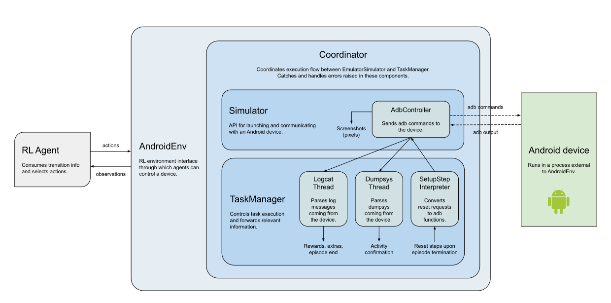

# Readme

## Internal structure of AndroidEnv

Refer to: [AndroidEnv Internal Structure](https://github.com/deepmind/android_env/blob/main/docs/environment.md#internal-structure-of-androidenv)

The chart below gives an overview of the internal workings of the system, illustrating how different classes interact with each other and what their
individual roles are. See the source code for more details.

